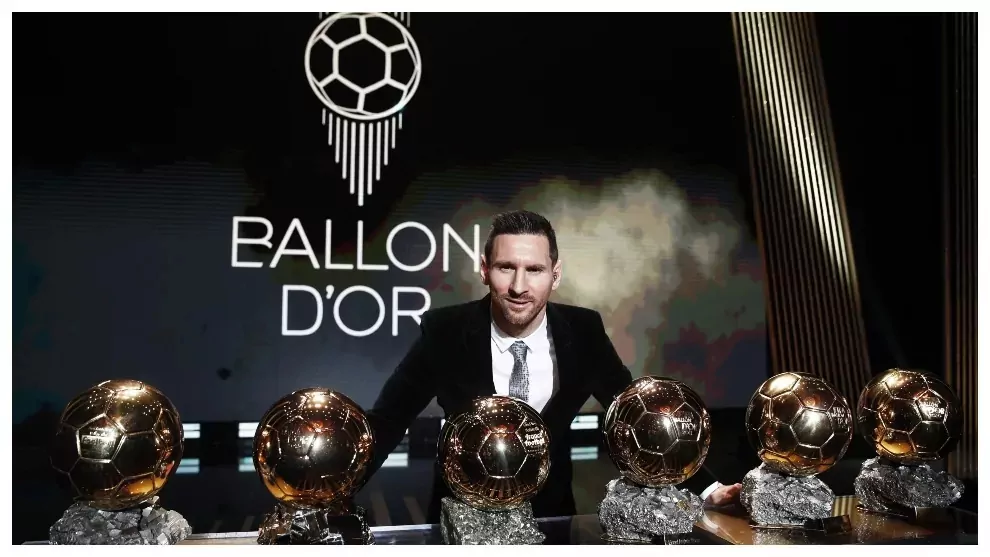

# Gerard Project II - Pipelines

## FIFA Videogame 🕹️
FIFA, also known as FIFA Football and to be rebranded as EA Sports FC from 2023, is a series of association football video games developed and released annually by Electronic Arts under the EA Sports label. As of 2011, the FIFA franchise has been localised into 18 languages and available in 51 countries. Listed in Guinness World Records as the best-selling sports video game franchise in the world, the FIFA series has sold over 325 million copies as of 2021.

### 🕺🏼 FIFA is widely considered the best sports video game franchise in the world!

A key factor of FIFA's success is its realism; EA Sports developers keep making huge efforts to make the game more and more close to how a real football game looks like from a TV. More on that, realism does not only lie in the visuals of the game but also on the behaviour and actual performance of players within the game. 

FIFA has license on most professional leagues and competitions, so the game is played with real clubs and players, which make it really attractive for the user. However, this implies a high degree of complexity and uniqueness; there is not a single player with exactly the same attributes.

Each player has its ratings and attributes. Here an example 🐐:

The range of attibutes is quite extensive, and its goal is to define as precisely as possible the playing style of that given character.

## Ballon d'Or ceremony 🌟

The Ballon d'Or is an annual football award presented by French news magazine France Football since 1956. Conceived by sports writers Gabriel Hanot and Jacques Ferran, the Ballon d'Or award honours the male and female players deemed to have performed the best over the previous year, based on voting by football journalists, and coaches and national teams capitains from countries belonging to FIFA World Ranking top 100.

## Report objectives 🎯

The goal of this report is to set statistical relationships between last five Ballon d'Or classifications (in male category) and that particular year FIFA players' ratings, to observe how each attribute correlate with the final results.

To conduct the analysis, we will use a csv file containing the historical FIFA ratings from 2015. Paralelly, we will obtain the mentioned Ballon d'Or results through web scrapping techniques. Once we have the two datasources, we will clean and mix them so that we can run some inferences and provide visualizations afterwards.

Last, we will try to predict which would have been the winner of 2020's Ballon d'Or according to FIFA ratings, which was not awarded due to COVID pandemic. Also, if possible, we could try to predict this years' winner following a similar process.

## Table of contents
### Data obtention and cleaning
- Get dataframe of FIFA ratings CSV
- Get last 5 Ballon d'Or results
- Filter FIFA ratings dataframe by year and players
- Define attributes of interest
- Merge classification votes to ratings dataframe
- Split datasets: Players and Goalkeepers
- Minor adjustments: generic position

### Statistical analysis and visualizations
Correlations between Ballon d'Or points and FIFA ratings.
Definition of FIFA attributes of interest

Players
- Ratings

- Positions

- Shot

- Pass

- Skills

Goalkeepers
- Ratings
- Goalkeeper attributes

- Correlation measures
    - Overall rating/votes
    - Position in the field/votes
    - Other attributes/votes