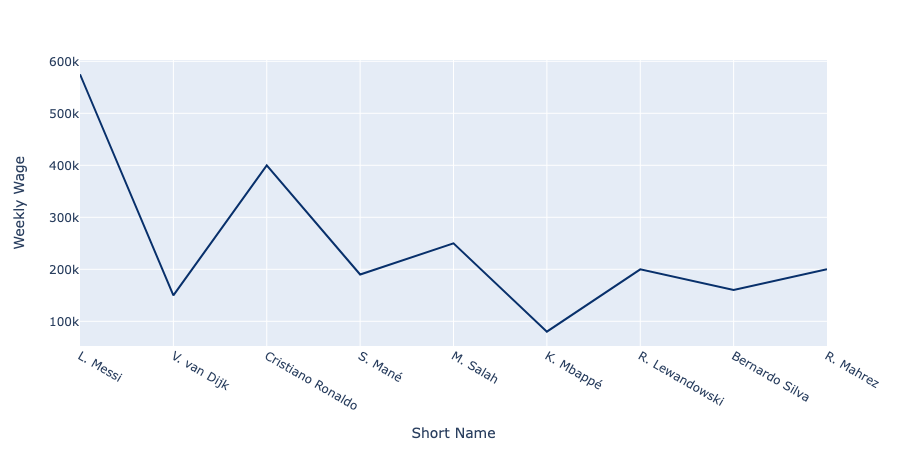
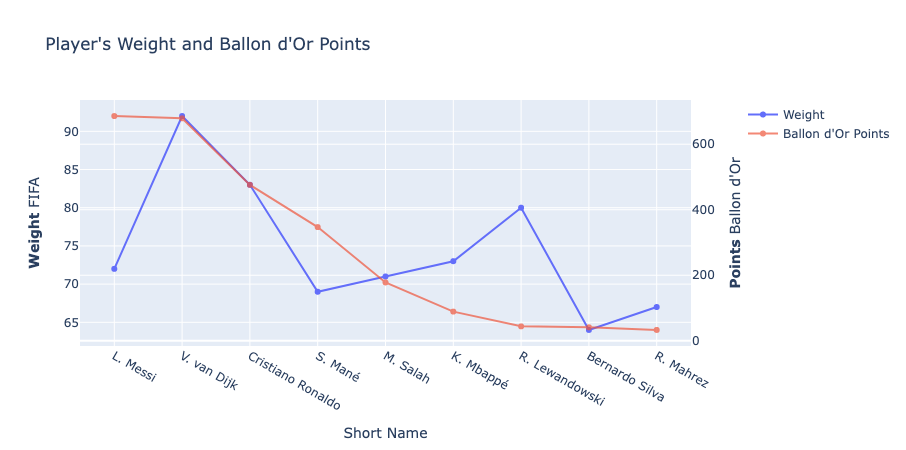
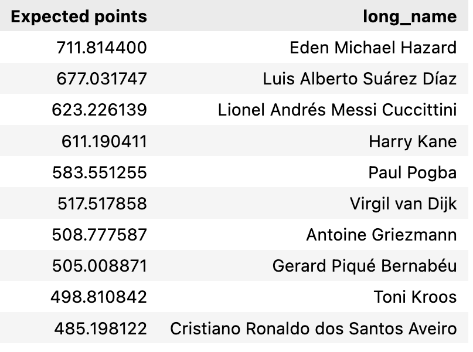

# Gerard Project II - Pipelines

---

## FIFA Videogame 🕹️
FIFA, also known as FIFA Football and to be rebranded as EA Sports FC from 2023, is a series of association football video games developed and released annually by Electronic Arts under the EA Sports label. As of 2011, the FIFA franchise has been localised into 18 languages and available in 51 countries. Listed in Guinness World Records as the best-selling sports video game franchise in the world, the FIFA series has sold over 325 million copies as of 2021.

### 🕺🏼 FIFA is widely considered the best sports video game franchise in the world!

A key factor of FIFA's success is its realism; EA Sports developers keep making huge efforts to make the game more and more close to how a real football game looks like from a TV. More on that, realism does not only lie in the visuals of the game but also on the behaviour and actual performance of players within the game. 

FIFA has license on most professional leagues and competitions, so the game is played with real clubs and players, which make it really attractive for the user. However, this implies a high degree of complexity and uniqueness; there is not a single player with exactly the same attributes.

Each player has its ratings and attributes. Here an example 🐐:

The range of attibutes is quite extensive, and its goal is to define as precisely as possible the playing style of that given character.

## Ballon d'Or ceremony 🌟

The Ballon d'Or is an annual football award presented by French news magazine France Football since 1956. Conceived by sports writers Gabriel Hanot and Jacques Ferran, the Ballon d'Or award honours the male and female players deemed to have performed the best over the previous year, based on voting by football journalists, and coaches and national teams capitains from countries belonging to FIFA World Ranking top 100.

## Report objectives 🎯

The goal of this report is to set statistical relationships between last five Ballon d'Or classifications (in male category) and that particular year FIFA players' ratings, to observe how each attribute correlate with the final results.

To conduct the analysis, we will use a csv file containing the historical FIFA ratings from 2015. Paralelly, we will obtain the mentioned Ballon d'Or results through web scrapping techniques. Once we have the two datasources, we will clean and mix them so that we can run some inferences and provide visualizations afterwards.

Last, we will try to predict which would have been the winner of 2020's Ballon d'Or according to FIFA ratings, which was not awarded due to COVID pandemic.

---

## Table of contents
### Data obtention and cleaning
- Get dataframe of FIFA ratings CSV
- Get last 5 Ballon d'Or results
- Filter FIFA ratings dataframe by year and players
- Define attributes of interest
- Merge classification votes to ratings dataframe
- Split datasets: Players and Goalkeepers
- Minor adjustments: generic position

### Statistical analysis and visualizations
- Correlations between Ballon d'Or points and FIFA ratings.
- Definition of FIFA attributes of interest

Non-FIFA rating data
- Player position
    - Player generic position
    - Player specific position distribution
- Country
- League
- Wage distribution
- Age distribution - Ballon d'Or points

FIFA ratings
- Overall rating - Ballon d'Or points
- FIFA Stats:
    - Pace, shooting, passing, dribbling, defending and physique

### Regression analysis and 2020 winner prediction
- Definition of explanatory variables
- Creation of the model
- Results

---

# Obtention of the data, cleaning and merge
The data obtention process started by choosing the main csv file: male_players (legacy).csv.
This file contained massive amounts of data from last 8 FIFA videogame editions, about players stats and other insights. It had +100,000 rows and +100 columns. In parallel, we used some web scrapping techniques to get some data about the classification and points awarded in the last 5 editions of the Ballon d'Or.

We used several functions to clean data, by reducing columns, filtering by year, among others. Also, we modified a little bit the tables obtained by scrapping the web, getting each edition top 10. However, the core of the cleaning process lied on the attempt to merge Ballon d'Or points and FIFA ratings dataframes together.

We used dictionaries, to create pivot dataframes to rearrange the order of points to match the FIFA ratings, so we could append those points to the correct player and have them as a dependent variable for us to perform the final regression. All processes are available at fifa_ratings.ipynb.

---

# Statistical analysis and visualizations
According the FIFA ratings file, where we have performed the function with deviations from 2020's FIFA ratings dataset, we have decided that we will use 2019's FIFA ratings dataframe in order to run the regression model. Hence, we start inspecting this dataframe with variables' correlations with points, separating between players and goalkeepers.

From players' datasets, we obtain correlations between every numeric variable and points obtained in Ballon d'Or. This is a very important step since we can define statistical relationships between the dependent variable (points in Ballon d'Or ceremonies), and all explanatory variables (FIFA's ratings and player attributes).

We choosed the most similar to 2020 among the FIFA ratings dataframes since, in function of the year, the importance of FIFA attributes could dramatically. An example of that is the pace attribute; in 2017, the correlation between Ballon d'Or points and pace was very high (0.83). However, in 2022 it is even negative (-0.04).

Since the most similar of the datasets is the one corresponding to 2019, we print the correlations with respect to the points below.

The conclusions are the following:
- Overall rating has some incidence to points -> there is low variance, all ratings are close to each other.
- Weight and wage are the variables with strongest correlation -> tough, well paid players seem to have advantage.
- Defending is the most punctuable skill.
- The other player stats were very relevant.

Last on this, we will take the following variables as explanatory for the regression model:
- Overall
- Wage (in €)
- Age
- Weight
- FIFA Stats: pace, shooting, passing, dribbling, defending and physic.

---
# Non-FIFA stats data
## 2019 Ballon d'Or classification
Here we have the classification of 2019's Ballon d'Or. A particularity is that a few players tend to get the wide makority of all votes. In this case, Leo Mesi, Virgil Van Dijk and Cristiano Ronaldo have most of the points.

Also, most players in the top 10 are attackers or attacking midfielders, so we can expect that our prediction has a similar trend.

## Player position

The first plot to start understanding the distribution of Ballon d'Or nominations is the following piechart. In it, we have the proportion of top 10 players for each generic position: attacker, midfielder, defender or goalkeeper. It is observable that attackers have been the most common players in Ballon d'Or top 10's. 

## Distribution of specific positions
In this second plot regarding players' specific roles we get more detail about the distribution

## Country
In the histogram below there is the distribution of last 5 years top 10 players' nationalities. Most of countries that appear are from Europe, except some exceptions from South America and some cases from Africa. Only 3 continents are represented.

## League
Concerning domestic competitions, all players in five last Ballon d'Or editions play in one of the big five leagues:
- La Liga (Spain)
- Premier League (UK)
- Ligue 1 (France)
- Bundesliga (Germany)
- Serie A (Italy)

La Liga and Premier League have the greatest representation.

## Wage distribution
In the following graph we observe how wage is distributed among top 10 players. The plot is ordered by top 10 Ballon d'Or results by names, in the x-axis, being the firsts in the left and descending towards the right. it can be seen that Players in the first places have higher wages.

## Age and Points distribution
Age was one of the variables with strongest correlation to Ballon d'Or points. In the graph below, we see that the higher the age, the more points obtained in the Ballon d'Or classification.

---

# FIFA attributes and stats

Now we focus on the variables that we want to make explanatory for the results in a Ballon d'Or ceremony: the FIFA ratings and attributes. 

## Weight distribution
Now it is the turn of the variable with the strongest correlation to points: weight.
We observe that both lines run almost parallely, there are only two players that are in differ considerably from the expected value: Leo Messi, thinner than most of the rest, and Robert Lewandowski, who is above the mean.

## Stats distribution
To finish, we plot the graph of player's full stats.
The attributes that get higher values tend to be those corresponding to attacking skills, which is expected due to the fact that most players roles are based on attacking (ST, RW, LW, etc.).
Defending skills have a low average, the only defender in 2019's top 10 was Van Dijk. However, since he is in second position, it somehow averages with Messi's and Cristiano's defending stats and then, the rest of players confirm a decreasing trend, which makes it be quite highly correlated with Points distribution.
In conclusion, since most of Ballon d'Or nominees use to play in offensive positions, it will be more probable that 2020's winner is also an attacker.

---

# Regression model

The last step of the project is to predict who would have been the winner of 2020's Ballon d'Or. To do so, we run a regression with some of the variables that could be more correlated with the distribution of points. The whole process is included in the visualizations and analysis jupyter file.

Here the result!

# In a parallel world... 🤯

